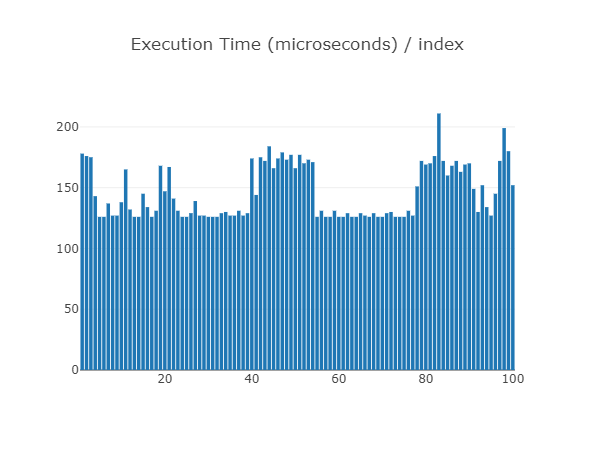
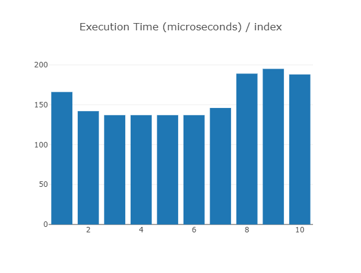
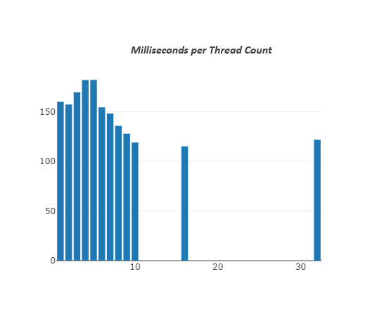
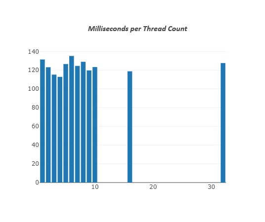
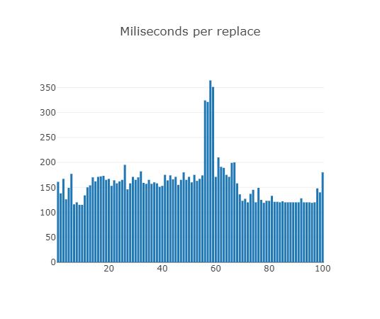
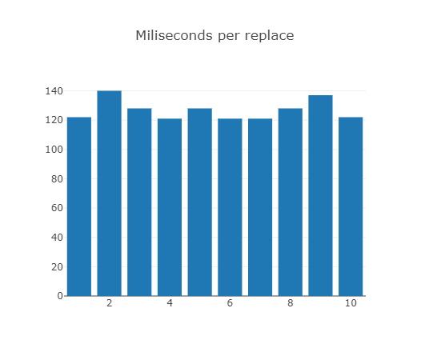
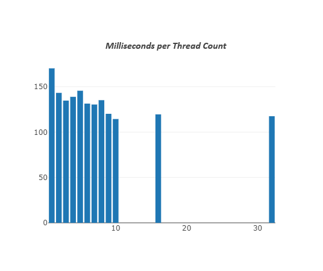
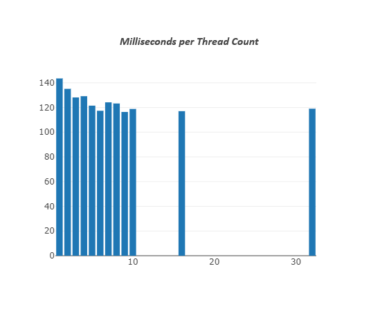
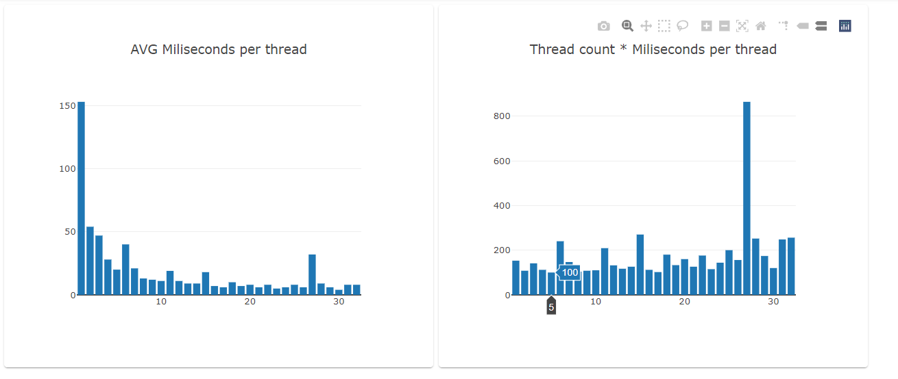
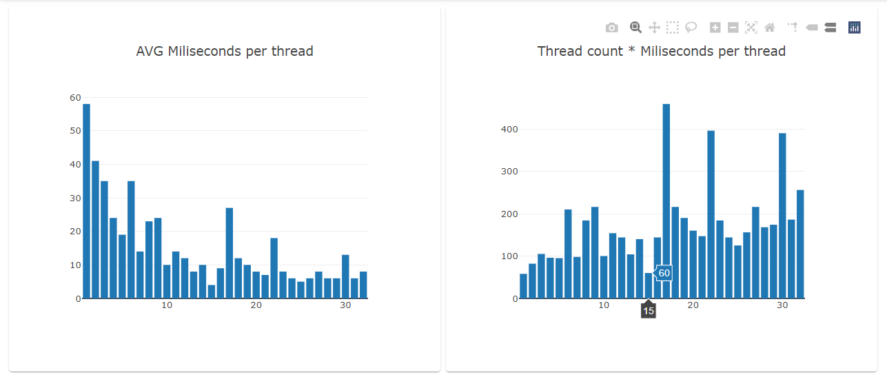

# Аналітика виконання алгоритму:
`Бібліотечний алгоритм:`

Для 100 операцій маємо такий графік:

 Для 10 операцій маємо такий графік:

 Операції з різною кількістю потоків 1-10,16,32:

 

##  `Поліфіл:`

 Для 100 операцій маємо такий графік:

 Для 10 операцій маємо такий графік:

 Операції з різною кількістю потоків 1-10,16,32:

 

## `Операції з різною кількістю потоків 1-32 кастомного алгоритму (threadPolyfillAnalyticsV2.cpp):`

 Найбільш оптимальна к-ть потоків 4-5;

